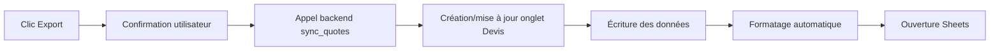
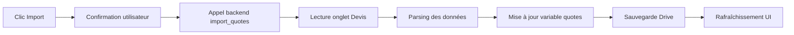

# 📊 Synchronisation Devis avec Google Sheets

## Vue d'ensemble

Les **devis** sont déjà automatiquement **sauvegardés sur Google Drive** via le fichier `mti_data.json`, exactement comme les factures. Cette documentation explique comment activer la **synchronisation bidirectionnelle avec Google Sheets** pour faciliter la gestion et l'analyse des devis.

## ✨ Nouveautés (Décembre 2024)

### Interface utilisateur
- **Formatage français** : Séparateur d'espace pour les milliers et virgule décimale (ex: `1 234,56 €`)
- **PDF optimisé** : Ajustement des largeurs de colonnes pour un rendu professionnel

### Sélection client
- **Dropdown intelligent** : Liste déroulante avec les clients existants
- **Auto-remplissage** : SIRET et Adresse automatiquement complétés depuis la fiche client
- **Saisie manuelle** : Option disponible pour les nouveaux clients

### API URSSAF
- **Récupération séparée** : Interrogation de deux règles API distinctes
  - `cotisations et contributions . cotisations` : 12,3% (URSSAF)
  - `cotisations et contributions . CFP` : 0,2% (Formation professionnelle)
- **Calculs précis** : Taux récupérés directement sans calcul par soustraction
- **Évolutivité** : Mise à jour automatique si les taux légaux changent

## État actuel de l'intégration

### Sauvegarde Drive (DÉJÀ ACTIF)

- **Fichier** : `mti_data.json` sur Google Drive
- **Données** : `{ clients, invoices, quotes, tasks, rams, recurringInvoices, companyInfo, taxSettings }`
- **Fonctions** :
  - `saveToDrive()` - [app.js#L219](../app.js#L219) - Sauvegarde automatique incluant `quotes`
  - `loadFromDrive()` - [app.js#L247](../app.js#L247) - Restauration automatique des `quotes`

### Synchronisation Sheets (ACTIF)

- **Boutons UI** : Ajoutés dans l'onglet DEVIS [index.html#L1038](../index.html#L1038)
  - 📥 Importer depuis Sheets
  - 📤 Exporter vers Sheets
- **Fonctions frontend** : [app.js#L8783](../app.js#L8783)
  - `exportQuotesToSheets()` - Export vers Google Sheets
  - `importQuotesFromSheets()` - Import depuis Google Sheets
- **Fonctions backend** : [backend/AppScript.js](../backend/AppScript.js)
  - `syncQuotes(sheetId, quotes)` - Écriture dans Sheets (lignes 1375-1450)
  - `importQuotes(sheetId)` - Lecture depuis Sheets (lignes 1475-1527)
  - `formatQuoteDescription(items)` - Helper de formatage (lignes 1453-1465)
  - `parseQuoteDescription(description)` - Helper de parsing (lignes 1530-1566)

### Étape 1 : Créer l'onglet "Devis" dans Google Sheets

1. Ouvrez votre Google Spreadsheet :
   ```
   https://docs.google.com/spreadsheets/d/1Zu6I-c64YrBdlfvWhiVnlbwbvhv6Mw5NL8iRn2mvXoE
   ```

2. Créez un nouvel onglet nommé **exactement** `Devis` (avec majuscule)

3. *(Optionnel)* Pré-formattez les en-têtes (ils seront automatiquement créés lors du premier export) :

   | Numéro | Client | Client SIRET | Client Adresse | Date | Validité | Statut | Description | Montant HT | Montant TTC | Facture liée | Créé le | Notes |
   |--------|--------|--------------|----------------|------|----------|--------|-------------|------------|-------------|--------------|---------|-------|

### Étape 2 : Déployer la nouvelle version du backend

1. Ouvrez votre projet Google Apps Script :
   ```
   https://script.google.com/home
   ```

2. Sélectionnez votre projet backend MTI CONSULTING

3. Le fichier [backend/AppScript.js](../backend/AppScript.js) contient déjà les fonctions `syncQuotes` et `importQuotes`

4. **Déployez une nouvelle version** :
   - Cliquez sur "Déployer" > "Gérer les déploiements"
   - Cliquez sur ⚙️ (à droite du déploiement actif) > "Modifier"
   - Sélectionnez "Nouvelle version" dans le menu déroulant
   - Ajoutez une description : "Ajout synchronisation devis"
   - Cliquez sur "Déployer"

5. **Important** : Notez le nouveau numéro de version

### Étape 3 : Tester la synchronisation

1. Ouvrez l'application MTI CONSULTING
2. Allez dans l'onglet **DEVIS**
3. Créez quelques devis de test
4. Cliquez sur **📤 Exporter vers Sheets**
5. Vérifiez que les données apparaissent dans Google Sheets
6. Modifiez un devis dans Sheets
7. Cliquez sur **📥 Importer depuis Sheets**
8. Vérifiez que les modifications sont bien importées

## 📊 Structure des données exportées

### Colonnes dans Google Sheets

| Colonne | Description | Type | Exemple |
|---------|-------------|------|---------|
| **Numéro** | Numéro unique du devis | Texte | `DEVIS-202512-001` |
| **Client** | Nom du client | Texte | `ACME Corporation` |
| **Client SIRET** | SIRET du client | Texte | `12345678901234` |
| **Client Adresse** | Adresse complète | Texte | `10 rue de Paris, 75001 Paris` |
| **Date** | Date d'émission | Date | `14/12/2025` |
| **Validité** | Date de validité | Date | `13/01/2026` |
| **Statut** | État du devis | Texte | `Brouillon`, `Envoyé`, `Accepté`, `Refusé`, `Converti` |
| **Description** | Prestations | Texte | `Prestation A (2 × 500€) \| Prestation B (1 × 300€)` |
| **Montant HT** | Total hors taxes | Nombre | `1300` |
| **Montant TTC** | Total TTC | Nombre | `1560` |
| **Facture liée** | Numéro de facture si converti | Texte | `F-202512-015` |
| **Créé le** | Date de création | Date | `14/12/2025` |
| **Notes** | Notes additionnelles | Texte | `Client important` |

### Format de la description

Les prestations multiples sont concaténées avec le séparateur ` | ` :

```
Développement site web (10 × 500€) | Formation (2 × 300€) | Support (1 × 200€)
```

Ce format permet :
- Affichage lisible dans Sheets
- Export/import sans perte de données
- Reconstruction des items lors de l'import

## 🔄 Workflow de synchronisation

### Export (Application → Sheets)



**Actions automatiques** :
- Création de l'onglet "Devis" s'il n'existe pas
- Écrasement du contenu existant (mode REPLACE)
- Formatage de l'en-tête (fond vert MTI, texte blanc, gras)
- Auto-redimensionnement des colonnes
- Gel de la ligne d'en-tête

### Import (Sheets → Application)



**Validations** :
- Vérification de l'existence de l'onglet "Devis"
- Parsing des lignes avec reconstruction des items
- Sauvegarde automatique dans Drive après import
- Mise à jour de la liste des devis dans l'UI

## ⚙️ Détails techniques

### Gestion du cache

Les devis importés depuis Sheets **remplacent** les devis locaux. La sauvegarde Drive garantit la persistance :

```javascript
async function importQuotesFromSheets() {
  // ... import logic ...
  quotes = result.data.quotes || [];  // REMPLACEMENT COMPLET
  await saveToDrive();                 // SAUVEGARDE DRIVE
  renderQuoteList();                   // MISE À JOUR UI
}
```

### Parsing des items multi-lignes

Le backend reconstruit les items à partir de la description :

```javascript
// Dans Sheets : "Dev web (10 × 500€) | Formation (2 × 300€)"
// Devient :
[
  { description: "Dev web", quantity: 10, unitPrice: 500, total: 5000 },
  { description: "Formation", quantity: 2, unitPrice: 300, total: 600 }
]
```

### Gestion des erreurs

Toutes les fonctions incluent des try/catch avec messages explicites :

```javascript
try {
  const result = await callBackend('sync_quotes', { sheetId, quotes });
  if (!result.success) throw new Error(result.data);
  alert(`${result.data.count} devis exportés avec succès`);
} catch (error) {
  alert(`❌ Erreur export : ${error.message}`);
}
```

## 🆚 Comparaison avec les autres synchronisations

### Clients

- **Onglet** : "Clients"
- **Actions** : `importClients`, `exportClients`
- **Particularité** : Enrichissement via API Pappers

### RAMs (Rapports d'Activité)

- **Onglet** : "RAM"
- **Actions** : `sync_rams`, `import_rams`
- **Particularité** : Historique cumulatif (pas d'écrasement)

### Devis (NOUVEAU)

- **Onglet** : "Devis"
- **Actions** : `sync_quotes`, `import_quotes`
- **Particularité** : Écrasement complet + parsing items multi-lignes

## 📖 Utilisation recommandée

### Cas d'usage 1 : Export pour analyse

1. Créez plusieurs devis dans l'application
2. Exportez vers Sheets
3. Utilisez les fonctions Sheets (tableaux croisés, graphiques) pour analyser :
   - Taux de conversion par client
   - Montants moyens
   - Délais de validation

### Cas d'usage 2 : Modification en masse

1. Exportez les devis vers Sheets
2. Modifiez plusieurs statuts/dates en masse dans Sheets
3. Importez les modifications dans l'application

### Cas d'usage 3 : Backup externe

1. Exportez régulièrement vers Sheets
2. Utilisez Google Sheets comme backup secondaire (en plus de Drive)
3. Sheets conserve l'historique des versions

## ⚠️ Limitations et précautions

### Limitations

- **Pas de synchronisation temps réel** : Import/export manuel uniquement
- **Écrasement complet** : L'import remplace tous les devis locaux
- **Parsing partiel** : Les descriptions complexes peuvent être simplifiées

### Précautions

1. **Toujours confirmer avant import** : Les données locales non sauvegardées seront perdues
2. **Vérifier le format Sheets** : Ne pas modifier les en-têtes de colonnes
3. **Tester avec peu de données** : Commencez par 2-3 devis pour valider

## 🔧 Dépannage

### Erreur : "Feuille 'Devis' introuvable"

**Cause** : L'onglet "Devis" n'existe pas dans Google Sheets

**Solution** :
1. Ouvrez votre Google Spreadsheet
2. Créez un onglet nommé exactement `Devis` (majuscule)
3. Réessayez l'import/export

### Erreur : "Action sync_quotes non reconnue"

**Cause** : Le backend n'a pas été mis à jour avec les nouvelles fonctions

**Solution** :
1. Vérifiez que vous avez copié les fonctions dans `Code.gs`
2. Vérifiez que vous avez ajouté les actions dans `doPost()`
3. Redéployez le backend (nouvelle version)

### Import réussi mais liste vide

**Cause** : Format de données incompatible dans Sheets

**Solution** :
1. Vérifiez que l'onglet "Devis" contient des données (pas seulement l'en-tête)
2. Vérifiez que les colonnes "Numéro" et "Client" ne sont pas vides
3. Consultez la console JavaScript pour voir les erreurs de parsing

### Export ne crée pas l'onglet

**Cause** : Permissions insuffisantes sur le Spreadsheet

**Solution** :
1. Vérifiez que vous êtes propriétaire du Spreadsheet
2. Vérifiez que le SHEETS_ID dans la config est correct
3. Réautorisez le backend Google Apps Script (via "Exécuter" dans l'éditeur)

## 📚 Ressources

- **Code frontend** : [app.js#L8783-L8850](../app.js#L8783)
- **Code backend** : [backend/quote_functions_to_add.gs](../backend/quote_functions_to_add.gs)
- **Boutons UI** : [index.html#L1038-L1042](../index.html#L1038)
- **Documentation Google Sheets API** : https://developers.google.com/sheets/api
- **Documentation Google Apps Script** : https://developers.google.com/apps-script

## Checklist d'installation

- [ ] Créer l'onglet "Devis" dans Google Sheets
- [ ] Déployer une nouvelle version du backend (les fonctions sont déjà dans AppScript.js)
- [ ] Tester l'export avec 2-3 devis
- [ ] Vérifier que les données apparaissent dans Sheets
- [ ] Tester l'import depuis Sheets
- [ ] Valider que les données sont bien restaurées dans l'application

---

**Créé le** : 14 décembre 2025  
**Version** : 1.0.0  
**Auteur** : MTI CONSULTING  
**Statut** : Implémenté et documenté
